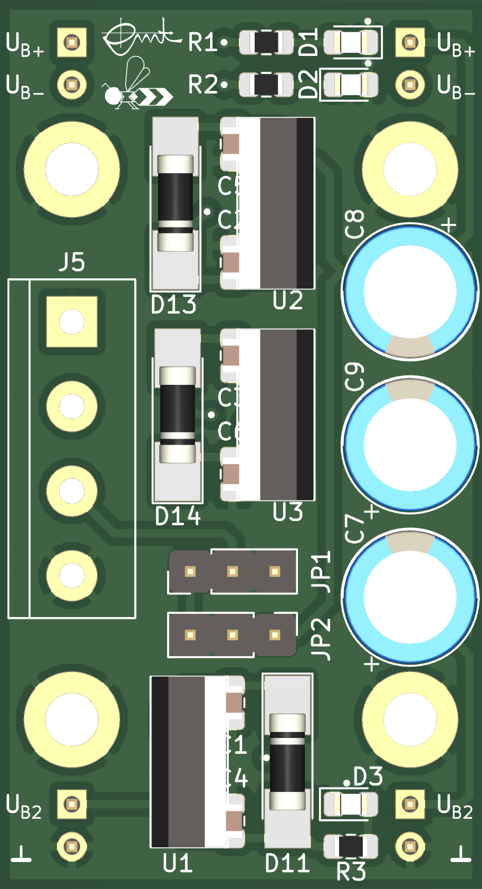

bee-pow
=======

The **pow**er supply [bee](https://github.com/beecourse) provides the voltages U_B+ = 15 V, U_B- = - 15 V and U_B2.
The value of U_B2 depends on the jumpers at JP1 and JP2 according to the following table (`--` indicates the jumper position):

  JP1  |  JP2  |          U_B2
-------|-------|------------------------
 `ooo` | `o--` | 5 V generated from U_B2
 `--o` | `--o` | 5 V generated from U3
 `o--` | `ooo` | U3

